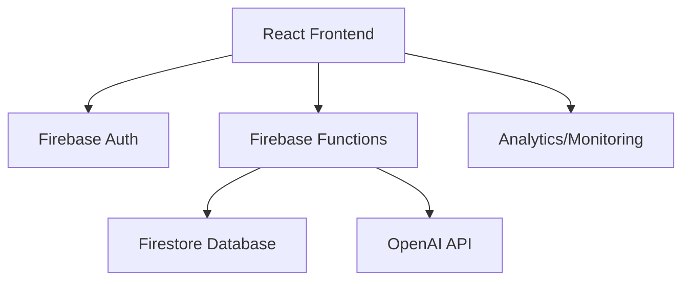

# ShopSyncAI Technical Documentation

## Architecture Overview

### System Architecture


## Core Components

### Frontend Architecture
- **React 18.x**: Main frontend framework
- **Redux Toolkit**: State management
- **Material-UI v5**: UI components
- **React Router v6**: Routing
- **Firebase SDK v9**: Backend services

### Monitoring System
- Performance tracking
- Error logging
- Analytics events
- User session tracking
- Memory usage monitoring
- Network request tracking

### Authentication System
- Email/Password authentication
- Session management
- Protected routes
- User role management

### Database Schema

#### Users Collection
```javascript
users: {
  id: string,
  email: string,
  displayName: string,
  households: Array<string>,
  preferences: {
    theme: string,
    notifications: boolean,
    language: string
  },
  createdAt: timestamp,
  lastLogin: timestamp
}
```

#### Households Collection
```javascript
households: {
  id: string,
  name: string,
  members: Array<{
    userId: string,
    role: string,
    joinedAt: timestamp
  }>,
  lists: Array<string>,
  createdAt: timestamp,
  updatedAt: timestamp
}
```

#### Shopping Lists Collection
```javascript
lists: {
  id: string,
  householdId: string,
  name: string,
  items: Array<{
    id: string,
    name: string,
    quantity: number,
    category: string,
    addedBy: string,
    addedAt: timestamp,
    completed: boolean
  }>,
  createdBy: string,
  createdAt: timestamp,
  updatedAt: timestamp
}
```

## Security Implementation

### Firebase Security Rules
```javascript
rules_version = '2';
service cloud.firestore {
  match /databases/{database}/documents {
    // User document rules
    match /users/{userId} {
      allow read: if request.auth.uid == userId;
      allow write: if request.auth.uid == userId;
    }
    
    // Household rules
    match /households/{householdId} {
      allow read, write: if request.auth.uid in resource.data.members;
    }
    
    // Shopping list rules
    match /lists/{listId} {
      allow read, write: if exists(/databases/$(database)/documents/households/$(resource.data.householdId)/members/$(request.auth.uid));
    }
  }
}
```

## Performance Optimization

### Code Splitting
- Route-based code splitting
- Component lazy loading
- Dynamic imports for large dependencies

### Caching Strategy
- Firebase offline persistence
- Redux persistence
- Browser cache optimization

### Bundle Optimization
- Tree shaking
- Minification
- Compression
- Asset optimization

## Error Handling

### Global Error Boundary
```javascript
class ErrorBoundary extends React.Component {
  componentDidCatch(error, errorInfo) {
    monitoringService.logError(error, {
      component: errorInfo.componentStack,
      severity: 'critical'
    });
  }
}
```

### API Error Handling
```javascript
async function apiCall(endpoint, options) {
  try {
    const response = await fetch(endpoint, options);
    if (!response.ok) throw new APIError(response);
    return await response.json();
  } catch (error) {
    monitoringService.logError(error, {
      endpoint,
      severity: 'error'
    });
    throw error;
  }
}
```

## Testing Strategy

### Unit Testing
- Jest for unit tests
- React Testing Library for component tests
- Mock service workers for API testing

### Integration Testing
- Cypress for E2E testing
- Firebase emulator testing
- Performance testing

### Test Coverage Requirements
- Minimum 80% code coverage
- Critical path testing
- Error scenario testing
